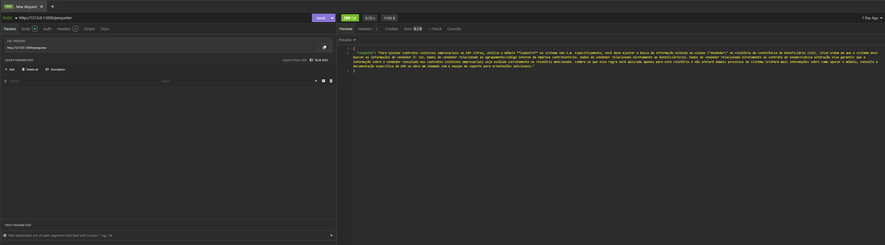
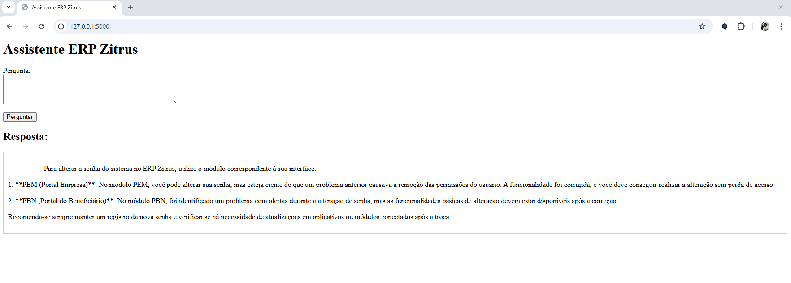

# 🤖 IA Generativa para Portal de Documentação

Este projeto integra um **modelo de IA generativa** a um portal de documentação, permitindo que o usuário faça perguntas em linguagem natural e receba respostas relevantes.  
Assim, é possível **resolver dúvidas, apoiar processos internos e sugerir melhorias** com base nas informações disponíveis.

---

## 📌 Objetivo
- Prover uma interface simples de **perguntas e respostas** baseada em IA.  
- Consultar um **portal de documentação (Confluence)** para enriquecer as respostas.  
- Expor um **endpoint HTTP** para fácil integração com sistemas internos.

---

## ⚙️ Como funciona
1. O usuário envia uma **pergunta** via `POST` para o endpoint `/perguntar`.  
2. O script em **Python + Flask** consulta o **Confluence** e recupera conteúdos relevantes.  
3. O contexto obtido é enviado a um **LLM da OpenAI (gpt-4o-mini)**.  
4. A IA retorna uma resposta objetiva, que é entregue ao usuário em formato JSON.

---

## 🛠️ Tecnologias utilizadas
- [Python 3](https://www.python.org/)  
- [Flask](https://flask.palletsprojects.com/) – microframework para API REST  
- [Requests](https://docs.python-requests.org/) – integração com Confluence API  
- [OpenAI API](https://platform.openai.com/) – modelo de linguagem (LLM)  
- [Confluence REST API](https://developer.atlassian.com/cloud/confluence/rest/)  

---

## 🚀 Etapas do desenvolvimento
1. Cadastro na [plataforma da OpenAI](https://platform.openai.com/docs/overview) e geração da **API Key**.  
2. Implementação do script em **Python** para automatizar o fluxo de busca e resposta.  
3. Exposição de um **endpoint Flask (POST /perguntar)** para receber perguntas em JSON.  

---

## 📡 Exemplo de uso

### Requisição
```bash
POST http://localhost:5000/perguntar
Content-Type: application/json

{
  "pergunta": "Como cadastrar um novo usuário no ERP?"
}
```

### Resposta
```json
{
  "resposta": "Para cadastrar um novo usuário no ERP, acesse o módulo de Administração..."
}
```

---

## 💻 Demonstração

### Consulta via Insomnia


### Página web para consulta


---

## 🧩 Script em Python
```python
import requests
from requests.auth import HTTPBasicAuth
from flask import Flask, request, jsonify
from openai import OpenAI

# Criação do app Flask (framework para criar APIs web rápidas em Python)
app = Flask(__name__)

# Configurações de acesso ao Confluence (ENDPOINT + credenciais de usuário e senha).
CONFLUENCE_URL = "https://confluence.zitrus.com.br"
CONFLUENCE_USER = "xxxxx"
SENHA = "xxxx"

# Criação de uma sessão HTTP que reaproveita conexão e já contém autenticação básica
session = requests.Session()
session.auth = HTTPBasicAuth(CONFLUENCE_USER, SENHA)

# Inicializa cliente da OpenAI com API Key (⚠️ não deve ficar exposta no código público)
client = OpenAI(api_key="sk-xxxxx")

# Função: buscar páginas no Confluence
def buscar_paginas_confluence(pergunta):
    url = f"{CONFLUENCE_URL}/rest/api/search"
    params = {"cql": f'text~"{pergunta}"', "limit": 5}
    response = session.get(url, params=params)
    response.raise_for_status()
    data = response.json()
    results = data.get("results", [])
    contexto = ""
    for result in results:
        content = result.get("content", result)
        page_id = content["id"]
        title = content["title"]
        page_url = f"{CONFLUENCE_URL}/rest/api/content/{page_id}"
        detail_response = session.get(page_url, params={"expand": "body.storage"})
        detail_response.raise_for_status()
        detail_data = detail_response.json()
        body = detail_data.get("body", {}).get("storage", {}).get("value", "")
        contexto += f"Título: {title}\n{body}\n\n"
    return contexto

# Função: perguntar para a IA
def perguntar_ia(pergunta, contexto):
    prompt = f"Pergunta: {pergunta}\n\nDocumentação relevante:\n{contexto}"
    response = client.chat.completions.create(
        model="gpt-4o-mini",
        messages=[
            {"role": "system", "content": "Você é um assistente especializado no ERP Zitrus."},
            {"role": "user", "content": prompt}
        ]
    )
    return response.choices[0].message.content.strip()

# Rota principal da API: /perguntar
@app.route('/perguntar', methods=['POST'])
def perguntar():
    data = request.json
    pergunta = data.get("pergunta")
    contexto = buscar_paginas_confluence(pergunta)
    resposta = perguntar_ia(pergunta, contexto)
    return jsonify({"resposta": resposta})

# Inicialização do servidor Flask
if __name__ == "__main__":
    app.run(debug=True)
```

---

## 📂 Estrutura do projeto
```
├── middlewaretotal.py      # Script principal em Python
├── requirements.txt        # Dependências do projeto
├── prints/                 # Prints de tela (Insomnia, web, etc.)
├── README.md               # Documentação do projeto
```

---

## ⚠️ Observações Importantes
- **Nunca exponha credenciais ou API Keys em repositórios públicos.**  
- Use variáveis de ambiente ou arquivos `.env` para armazenar senhas e tokens.  
- Para rodar em produção, utilize um servidor WSGI (Gunicorn, Uvicorn) em vez de `app.run(debug=True)`.

---

## 📜 Licença
Este projeto é distribuído sob a licença **MIT**.  
Sinta-se à vontade para usar, modificar e compartilhar.  
